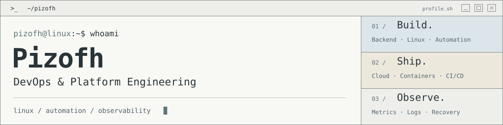

  <a href="https://www.linkedin.com/in/steve-garnica/"><strong>LinkedIn</strong></a>
  &nbsp; · &nbsp;
  <a href="#selected-work"><strong>Explore my projects</strong></a>

### I work where application code meets infrastructure.

I build backend services, automate deployments, and work with Linux systems. My experience combines enterprise operations in restricted environments with hands-on projects in cloud infrastructure, delivery pipelines, and observability.

**My focus:** repeatable deployments, useful operational signals, and automation that stays maintainable.

## Selected work

| Project | What I built |
| :--- | :--- |
| **[SimOps](https://github.com/Pizofh/SimOps)** Observability & operations | A multi-service lab for operational event ingestion, traffic simulation, and exploring application metrics and logs. FastAPI · PostgreSQL · Docker Compose · Prometheus · Grafana · Loki |
| **[SuperQTAS](https://github.com/Pizofh/SuperQtas)** Business automation & releases | A lightweight ERP inside Google Sheets, with separate QA and production environments, workflow tests, and controlled releases. Apps Script · JavaScript · clasp · GitHub Actions |
| **[JobOps](https://github.com/Pizofh/JobOps)** Workflow automation | A personal system for organizing job alerts, prioritizing opportunities, and tracking applications with testable JavaScript logic. JavaScript · Google Apps Script · Google Sheets · Node.js |

## How I work

- **Automate repeatable work.** Use Bash, Ansible, and delivery workflows to make operations easier to repeat.
- **Make systems observable.** Use metrics, logs, and health checks to support troubleshooting.
- **Keep changes controlled.** Separate environments, validate changes, and make releases explicit.

## Toolbox

| Area | Tools |
| :--- | :--- |
| Infrastructure & automation | Linux / RHEL / Ubuntu · AWS · Terraform · Ansible · Bash |
| Containers & delivery | Docker · Docker Compose · GitHub Actions · GitLab CI/CD |
| Observability | Prometheus · Grafana · Loki · CloudWatch |
| Backend & data | Python · FastAPI · Django · PostgreSQL |
| Web operations | Nginx · DNS · HTTPS/TLS · Cloudflare |

---

Based in **Bogotá, Colombia** · Spanish native · English B2, Cambridge FCE

Interested in **DevOps, Platform Engineering, Cloud Operations, and reliable software delivery**.

[Let's connect →](https://www.linkedin.com/in/steve-garnica/)

  

